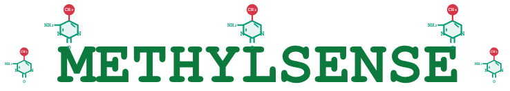
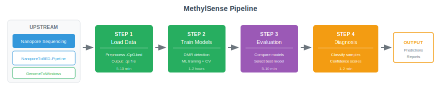
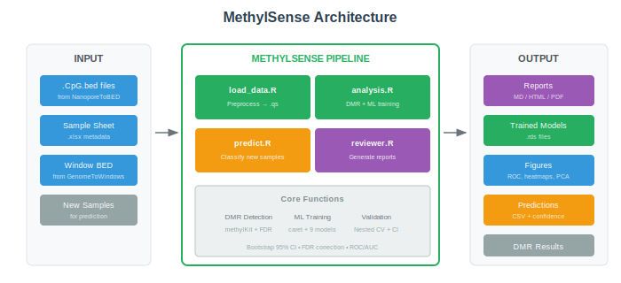

<div align="center">



**High-Accuracy Epigenetic Diagnostics via Nanopore Methylation Sequencing**

[](https://opensource.org/licenses/AFL-3.0)
[](https://www.r-project.org/)
[](https://github.com/markusdrag/MethylSense)

</div>

---

## Overview

MethylSense is an R-based bioinformatics pipeline for detecting differentially methylated regions (DMRs) from Oxford Nanopore sequencing data and building machine learning classifiers for clinical diagnostic applications.

### What is DNA Methylation?

DNA methylation is a fundamental epigenetic modification where methyl groups are added to cytosine bases, predominantly at CpG dinucleotides. These modifications regulate gene expression without altering the underlying DNA sequence. Changes in methylation patterns serve as sensitive biomarkers for disease states, environmental exposures, and therapeutic responses.

Cell-free DNA (cfDNA) in blood carries methylation signatures from dying cells throughout the body, making it an ideal non-invasive biomarker source. MethylSense leverages these epigenetic signatures to identify stable, reproducible methylation biomarkers that can distinguish between biological conditions with high accuracy.

### What Does MethylSense Do?

- **Detects Differentially Methylated Regions (DMRs)** — Identifies genomic regions with statistically significant methylation differences between groups (e.g., Control, Infected, Suspected) using the methylKit R package (Akalin et al., 2012) with false discovery rate (FDR) correction.

- **Trains Machine Learning Classifiers** — Builds diagnostic models using nine machine learning algorithms via the caret framework (Kuhn, 2008), including Random Forest, SVM, XGBoost, and Elastic Net.

- **Diagnoses New Samples** — Applies trained models to classify patient samples with probability scores and confidence estimates to support clinical decision-making.

- **Generates Publication-Ready Reports** — Creates comprehensive evaluation reports with ROC curves, confusion matrices, feature importance plots, and performance metrics suitable for publication.

Originally developed for avian Aspergillus fumigatus infection diagnosis using host cell-free DNA methylation, achieving >95% accuracy with nested cross-validation.

---

## Table of Contents

1. [Prerequisites](#prerequisites)
2. [Installation](#installation)
3. [Sample Sheet Format](#sample-sheet-format)
4. [Quick Start](#quick-start)
5. [Pipeline Components](#pipeline-components)
6. [Output Structure](#output-structure)
7. [Clinical Applications](#clinical-applications)
8. [Troubleshooting](#troubleshooting)
9. [Citation](#citation)
10. [Acknowledgements](#acknowledgements)
11. [License and Authors](#license-and-authors)

---

## Prerequisites

### Upstream Pipelines

MethylSense requires processed Nanopore methylation data. You must run these pipelines first to prepare your sequencing data:

**NanoporeToBED-Pipeline** ([GitHub](https://github.com/markusdrag/NanoporeToBED-Pipeline))

This pipeline converts raw Nanopore sequencing output (modBAM files from Guppy or Dorado basecallers) into standardised CpG BED files. It extracts 5-methylcytosine (5mC) modification calls at CpG dinucleotide sites, preserving methylation frequencies and read coverage information. Run this pipeline first before MethylSense.

**GenomeToWindows** ([GitHub](https://github.com/markusdrag/GenomeToWindows))

This utility generates genomic window BED files (typically 1kb, 5kb, 10kb, or 25kb) from a reference genome. These windows define the regions for DMR detection. Aggregating CpG-level data into larger genomic windows reduces noise from individual CpG site variation and provides sufficient statistical power for differential methylation testing.

### System Requirements

<table style="border-collapse: collapse; width: 100%;">
<thead>
<tr style="border-top: 2px solid #333; border-bottom: 1px solid #333;">
<th style="padding: 8px; text-align: left;">Component</th>
<th style="padding: 8px; text-align: left;">Minimum</th>
<th style="padding: 8px; text-align: left;">Recommended</th>
</tr>
</thead>
<tbody>
<tr><td style="padding: 8px; border-bottom: 1px solid #ddd;">R version</td><td style="padding: 8px; border-bottom: 1px solid #ddd;">4.0+</td><td style="padding: 8px; border-bottom: 1px solid #ddd;">4.2+</td></tr>
<tr><td style="padding: 8px; border-bottom: 1px solid #ddd;">RAM</td><td style="padding: 8px; border-bottom: 1px solid #ddd;">8 GB</td><td style="padding: 8px; border-bottom: 1px solid #ddd;">16+ GB</td></tr>
<tr><td style="padding: 8px; border-bottom: 1px solid #ddd;">CPU cores</td><td style="padding: 8px; border-bottom: 1px solid #ddd;">4</td><td style="padding: 8px; border-bottom: 1px solid #ddd;">8+</td></tr>
<tr><td style="padding: 8px; border-bottom: 1px solid #ddd;">Disk space</td><td style="padding: 8px; border-bottom: 1px solid #ddd;">10 GB</td><td style="padding: 8px; border-bottom: 1px solid #ddd;">50+ GB</td></tr>
<tr style="border-bottom: 2px solid #333;"><td style="padding: 8px;">Operating system</td><td style="padding: 8px;" colspan="2">Linux, macOS, or Windows with Rtools</td></tr>
</tbody>
</table>

---

## Installation

### Quick Install

```bash
git clone https://github.com/markusdrag/MethylSense.git
cd MethylSense

Rscript MethylSense_installer_v1.R

chmod +x MethylSense_*.R
```

The installer script automatically installs all required packages from both CRAN and Bioconductor. Installation typically takes 15-45 minutes depending on your system and existing packages. The script will report success or failure for each package and provide troubleshooting guidance if needed.

### Manual Installation

If you prefer manual installation, MethylSense depends on packages from both CRAN and Bioconductor:

```r
# CRAN packages
install.packages(c(
  "optparse", "qs", "caret", "pROC", "ggplot2", "dplyr", "tidyr",
  "randomForest", "e1071", "glmnet", "nnet", "class", "MASS",
  "klaR", "ranger", "xgboost", "pheatmap", "RColorBrewer",
  "data.table", "readxl", "reshape2", "viridis", "corrplot",
  "factoextra", "ggridges", "gridExtra", "ggrepel", "naivebayes",
  "tree", "rpart", "rpart.plot", "cluster", "jsonlite", "MLmetrics",
  "doParallel", "foreach", "pls", "PRROC", "igraph", "umap",
  "dendextend", "lme4", "nlme", "MuMIn", "ez", "fossil"
))

# Bioconductor packages
if (!require("BiocManager", quietly = TRUE))
    install.packages("BiocManager")
BiocManager::install(c("methylKit", "GenomicRanges", "genomation", "regioneR", "IRanges"))
```

### Verify Installation

```bash
Rscript -e "library(methylKit); library(caret); library(xgboost)"
Rscript MethylSense_load_data.R --help
```

---

## Sample Sheet Format

MethylSense requires a sample metadata file (Excel xlsx format) that describes your samples, their group assignments, and file locations. This information is essential for the pipeline to correctly load, process, and analyse your data.

### Required Columns

These columns must be present in your sample sheet:

<table style="border-collapse: collapse; width: 100%;">
<thead>
<tr style="border-top: 2px solid #333; border-bottom: 1px solid #333;">
<th style="padding: 8px; text-align: left;">Column</th>
<th style="padding: 8px; text-align: left;">Description</th>
<th style="padding: 8px; text-align: left;">Example</th>
</tr>
</thead>
<tbody>
<tr><td style="padding: 8px; border-bottom: 1px solid #ddd;">ID</td><td style="padding: 8px; border-bottom: 1px solid #ddd;">Unique sample identifier (must match BED filenames)</td><td style="padding: 8px; border-bottom: 1px solid #ddd;">sample_001</td></tr>
<tr><td style="padding: 8px; border-bottom: 1px solid #ddd;">Species</td><td style="padding: 8px; border-bottom: 1px solid #ddd;">Species name used for filtering samples</td><td style="padding: 8px; border-bottom: 1px solid #ddd;">Gallus_gallus</td></tr>
<tr><td style="padding: 8px; border-bottom: 1px solid #ddd;">bedFileOrg</td><td style="padding: 8px; border-bottom: 1px solid #ddd;">Original BED filename from NanoporeToBED</td><td style="padding: 8px; border-bottom: 1px solid #ddd;">sample_001.CpG.bed</td></tr>
<tr><td style="padding: 8px; border-bottom: 1px solid #ddd;">bedFile</td><td style="padding: 8px; border-bottom: 1px solid #ddd;">Output filename for converted BED (user-specified)</td><td style="padding: 8px; border-bottom: 1px solid #ddd;">sample_001_8col.bed</td></tr>
<tr style="border-bottom: 2px solid #333;"><td style="padding: 8px;">treatMethylkit</td><td style="padding: 8px;">Numeric group code for methylKit (any integer: 0, 1, 2, etc.)</td><td style="padding: 8px;">0, 1, 2</td></tr>
</tbody>
</table>

### Optional Columns

These columns provide additional metadata for reporting and stratification:

<table style="border-collapse: collapse; width: 100%;">
<thead>
<tr style="border-top: 2px solid #333; border-bottom: 1px solid #333;">
<th style="padding: 8px; text-align: left;">Column</th>
<th style="padding: 8px; text-align: left;">Description</th>
<th style="padding: 8px; text-align: left;">Example</th>
</tr>
</thead>
<tbody>
<tr><td style="padding: 8px; border-bottom: 1px solid #ddd;">Infection</td><td style="padding: 8px; border-bottom: 1px solid #ddd;">Human-readable group label</td><td style="padding: 8px; border-bottom: 1px solid #ddd;">Control, Infected, Suspected</td></tr>
<tr><td style="padding: 8px; border-bottom: 1px solid #ddd;">study</td><td style="padding: 8px; border-bottom: 1px solid #ddd;">Study or cohort identifier for stratified analysis</td><td style="padding: 8px; border-bottom: 1px solid #ddd;">Study_A</td></tr>
<tr><td style="padding: 8px; border-bottom: 1px solid #ddd;">Animal_ID</td><td style="padding: 8px; border-bottom: 1px solid #ddd;">Individual animal identifier</td><td style="padding: 8px; border-bottom: 1px solid #ddd;">Bird_42</td></tr>
<tr style="border-bottom: 2px solid #333;"><td style="padding: 8px;">Lab_ID</td><td style="padding: 8px;">Laboratory sample identifier</td><td style="padding: 8px;">LAB001</td></tr>
</tbody>
</table>

### Example Sample Sheet

```
ID            Species        bedFileOrg            bedFile                treatMethylkit  Infection
control_1     Gallus_gallus  control_1.CpG.bed     control_1_8col.bed     0               Control
control_2     Gallus_gallus  control_2.CpG.bed     control_2_8col.bed     0               Control
suspected_1   Gallus_gallus  suspected_1.CpG.bed   suspected_1_8col.bed   1               Suspected
suspected_2   Gallus_gallus  suspected_2.CpG.bed   suspected_2_8col.bed   1               Suspected
infected_1    Gallus_gallus  infected_1.CpG.bed    infected_1_8col.bed    2               Infected
infected_2    Gallus_gallus  infected_2.CpG.bed    infected_2_8col.bed    2               Infected
```

See the example_data folder for a complete working example with 15 samples (5 control, 5 suspected, 5 infected) demonstrating progressive methylation patterns.

---

## Quick Start



### Step 1: Load and Preprocess Data

Runtime: 5-10 minutes

This step converts raw CpG BED files into a unified methylKit object (qs format). The pipeline normalises coverage across samples, filters low-quality CpG sites, and prepares the data for downstream analysis.

```bash
Rscript MethylSense_load_data.R \
  --species "Gallus_gallus" \
  --sample_sheet ./example_data/sample_metadata.xlsx \
  --bed_dir ./example_data \
  --output_dir ./preprocessed
```

What happens: Each sample's CpG methylation data is loaded, filtered by minimum coverage thresholds, and combined into a single methylRawList object for efficient analysis.

Output: YYYYMMDD_Species_nN_methylRaw.qs

### Step 2: Train Diagnostic Models

Runtime: 1-2 hours (with 10-fold cross-validation)

This is the core analysis step. MethylSense identifies differentially methylated regions (DMRs) using the methylKit package, then trains machine learning classifiers to distinguish between your experimental groups.

```bash
Rscript MethylSense_analysis.R \
  --qs_file ./preprocessed/methylation_data.qs \
  --output_dir ./training \
  --window_file windows_5kb.bed \
  --models rf,svm,xgboost \
  --group_names Control,Infected,Suspected \
  --positive_class Infected \
  --cv_repeats 10 \
  --nested_cv
```

What happens:
1. Methylation levels are calculated within genomic windows
2. Statistical testing identifies DMRs with FDR correction (Benjamini-Hochberg)
3. DMR methylation values become features for machine learning
4. Multiple models are trained with cross-validation for robust performance estimates
5. Nested cross-validation provides unbiased accuracy estimates suitable for publication

Output: Trained models (rds files), DMR coordinates, cross-validation results, performance metrics

### Optional: Data Quality Assessment and Visualisation

Runtime: 5-15 minutes

**This step is optional but recommended** for exploring your DMR results and generating publication-ready visualisations. Run this after Step 2 to understand methylation patterns, assess data quality, and create comprehensive figures for presentations or publications.

```bash
Rscript MethylSense_general_data_overview.R \
  --analysis_dir ./training \
  --sample_sheet ./example_data/sample_metadata.xlsx \
  --region_sizes "1000,5000,10000,25000" \
  --output_dir ./data_overview \
  --plot_format png,pdf
```

What happens: The script analyses your DMR results and generates publication-ready figures including:
- DMR counts across different window sizes
- Volcano plots showing effect sizes and significance
- Coverage distribution analysis (quality control)
- Chromosomal distribution of DMRs
- Effect size characterisation (hypermethylated vs hypomethylated)
- Sample-level methylation heatmaps for top DMRs

Output: Comprehensive report with figures and statistics in data_overview/

**When to use:** Run this after Step 2 to visualise DMR results, compare different window sizes, and generate exploratory figures. This is particularly useful for understanding your data before selecting the best model for clinical diagnosis.

### Step 3: Model Evaluation and Selection

Runtime: 5-10 minutes

Before using a model for clinical diagnosis, evaluate its performance to select the best model. This step generates comprehensive reports with publication-ready figures to help you choose the optimal diagnostic model.

```bash
Rscript MethylSense_reviewer.R \
  --model_dir ./training/models/rf_model/ \
  --qs_file ./preprocessed/methylation_data.qs \
  --sample_sheet ./example_data/sample_metadata.xlsx \
  --output_dir ./report
```

What happens: The reviewer analyses model performance on the training data, generates ROC curves, confusion matrices, feature importance plots, and creates detailed reports. Compare performance across different models (rf, svm, xgboost) to select the best one for your diagnostic application.

Output: MODEL_EVALUATION_REPORT.md, html, pdf, figures, tables

### Step 4: Diagnose New Samples

Runtime: 1-2 minutes

Apply your selected model to classify new patient samples. This step produces diagnostic predictions with confidence scores to guide clinical decision-making.

First, preprocess your new samples using the load_data script (leave the treatMethylkit column empty or set to NA for unknown samples):

```bash
Rscript MethylSense_load_data.R \
  --species "Gallus_gallus" \
  --sample_sheet new_samples_metadata.xlsx \
  --bed_dir ./new_cpg_beds \
  --output_dir ./new_preprocessed
```

Then run prediction:

```bash
Rscript MethylSense_predict.R \
  --model_dir ./training/models/rf_model/ \
  --qs_file new_samples.qs \
  --output_dir ./predictions
```

What happens: New samples are processed using the same DMR regions from training. The trained model predicts each sample's disease status with a probability score indicating prediction confidence.

Output: Predictions (csv files), confidence scores, diagnostic plots

---

## Pipeline Components



### Core Scripts

<table style="border-collapse: collapse; width: 100%;">
<thead>
<tr style="border-top: 2px solid #333; border-bottom: 1px solid #333;">
<th style="padding: 8px; text-align: left;">Script</th>
<th style="padding: 8px; text-align: left;">Purpose</th>
<th style="padding: 8px; text-align: left;">Key Output</th>
</tr>
</thead>
<tbody>
<tr><td style="padding: 8px; border-bottom: 1px solid #ddd;">MethylSense_load_data.R</td><td style="padding: 8px; border-bottom: 1px solid #ddd;">Preprocess BED files into methylKit format</td><td style="padding: 8px; border-bottom: 1px solid #ddd;">qs methylRawList object</td></tr>
<tr><td style="padding: 8px; border-bottom: 1px solid #ddd;">MethylSense_analysis.R</td><td style="padding: 8px; border-bottom: 1px solid #ddd;">DMR detection and ML model training</td><td style="padding: 8px; border-bottom: 1px solid #ddd;">Trained models, DMR coordinates</td></tr>
<tr><td style="padding: 8px; border-bottom: 1px solid #ddd;">MethylSense_predict.R</td><td style="padding: 8px; border-bottom: 1px solid #ddd;">Clinical diagnosis of new samples</td><td style="padding: 8px; border-bottom: 1px solid #ddd;">Predictions with confidence scores</td></tr>
<tr style="border-bottom: 2px solid #333;"><td style="padding: 8px;">MethylSense_reviewer.R</td><td style="padding: 8px;">Clinical interpretation and reporting</td><td style="padding: 8px;">Evaluation reports and figures</td></tr>
</tbody>
</table>

### Optional Scripts

<table style="border-collapse: collapse; width: 100%;">
<thead>
<tr style="border-top: 2px solid #333; border-bottom: 1px solid #333;">
<th style="padding: 8px; text-align: left;">Script</th>
<th style="padding: 8px; text-align: left;">Purpose</th>
</tr>
</thead>
<tbody>
<tr><td style="padding: 8px; border-bottom: 1px solid #ddd;">MethylSense_general_data_overview.R</td><td style="padding: 8px; border-bottom: 1px solid #ddd;">Data quality assessment and exploratory visualisation</td></tr>
<tr style="border-bottom: 2px solid #333;"><td style="padding: 8px;">MethylSense_installer_v1.R</td><td style="padding: 8px;">Complete package installer with verification</td></tr>
</tbody>
</table>

### Available Machine Learning Models

MethylSense supports nine machine learning algorithms, implemented through the caret framework (Kuhn, 2008):

<table style="border-collapse: collapse; width: 100%;">
<thead>
<tr style="border-top: 2px solid #333; border-bottom: 1px solid #333;">
<th style="padding: 8px; text-align: left;">Model</th>
<th style="padding: 8px; text-align: left;">Code</th>
<th style="padding: 8px; text-align: left;">Speed</th>
<th style="padding: 8px; text-align: left;">Best Use Case</th>
</tr>
</thead>
<tbody>
<tr><td style="padding: 8px; border-bottom: 1px solid #ddd;">Random Forest</td><td style="padding: 8px; border-bottom: 1px solid #ddd;">rf</td><td style="padding: 8px; border-bottom: 1px solid #ddd;">Medium</td><td style="padding: 8px; border-bottom: 1px solid #ddd;">General purpose, feature importance analysis</td></tr>
<tr><td style="padding: 8px; border-bottom: 1px solid #ddd;">Support Vector Machine</td><td style="padding: 8px; border-bottom: 1px solid #ddd;">svm</td><td style="padding: 8px; border-bottom: 1px solid #ddd;">Medium</td><td style="padding: 8px; border-bottom: 1px solid #ddd;">High accuracy classification</td></tr>
<tr><td style="padding: 8px; border-bottom: 1px solid #ddd;">XGBoost</td><td style="padding: 8px; border-bottom: 1px solid #ddd;">xgboost</td><td style="padding: 8px; border-bottom: 1px solid #ddd;">Medium</td><td style="padding: 8px; border-bottom: 1px solid #ddd;">Best overall accuracy</td></tr>
<tr><td style="padding: 8px; border-bottom: 1px solid #ddd;">Elastic Net</td><td style="padding: 8px; border-bottom: 1px solid #ddd;">glmnet</td><td style="padding: 8px; border-bottom: 1px solid #ddd;">Fast</td><td style="padding: 8px; border-bottom: 1px solid #ddd;">Biomarker discovery, interpretable models</td></tr>
<tr><td style="padding: 8px; border-bottom: 1px solid #ddd;">Neural Network</td><td style="padding: 8px; border-bottom: 1px solid #ddd;">nnet</td><td style="padding: 8px; border-bottom: 1px solid #ddd;">Medium</td><td style="padding: 8px; border-bottom: 1px solid #ddd;">Complex non-linear patterns</td></tr>
<tr><td style="padding: 8px; border-bottom: 1px solid #ddd;">k-Nearest Neighbours</td><td style="padding: 8px; border-bottom: 1px solid #ddd;">knn</td><td style="padding: 8px; border-bottom: 1px solid #ddd;">Fast</td><td style="padding: 8px; border-bottom: 1px solid #ddd;">Simple datasets, baseline comparisons</td></tr>
<tr><td style="padding: 8px; border-bottom: 1px solid #ddd;">Linear Discriminant Analysis</td><td style="padding: 8px; border-bottom: 1px solid #ddd;">lda</td><td style="padding: 8px; border-bottom: 1px solid #ddd;">Fast</td><td style="padding: 8px; border-bottom: 1px solid #ddd;">Highly interpretable results</td></tr>
<tr><td style="padding: 8px; border-bottom: 1px solid #ddd;">Naive Bayes</td><td style="padding: 8px; border-bottom: 1px solid #ddd;">nb</td><td style="padding: 8px; border-bottom: 1px solid #ddd;">Fast</td><td style="padding: 8px; border-bottom: 1px solid #ddd;">Baseline comparisons</td></tr>
<tr style="border-bottom: 2px solid #333;"><td style="padding: 8px;">Fast Random Forest</td><td style="padding: 8px;">ranger</td><td style="padding: 8px;">Fast</td><td style="padding: 8px;">Large datasets</td></tr>
</tbody>
</table>

Model shortcuts: --models all, --models fast, --models biomarker

---

## Output Structure

### After MethylSense_analysis.R

```
output_directory/
├── analysis_summary.csv          # Complete results for all models
├── analysis_settings.txt         # Reproducibility settings
├── ANALYSIS_REPORT.md            # Summary report (Markdown)
├── ANALYSIS_REPORT.html          # Summary report (HTML)
├── run_log.txt                   # Complete execution log
├── ml_training_logs/             # Detailed ML training diagnostics
├── train_test_splits/            # Data partition information
├── precomputed_data/             # Cached intermediate results
├── complete_dmr_datasets/        # DMR statistics per window size
├── cv_analysis_plots/            # Cross-validation visualisations
└── models/                       # Trained model files
    ├── rf_model/
    │   ├── model.rds             # Serialised model object
    │   ├── dmr_coords.csv        # DMR coordinates used
    │   └── model_summary.txt     # Model performance summary
    ├── svm_model/
    └── xgboost_model/
```

### After MethylSense_reviewer.R

```
report_directory/
├── MODEL_EVALUATION_REPORT.md    # Comprehensive clinical report
├── MODEL_EVALUATION_REPORT.html  # Interactive HTML version
├── MODEL_EVALUATION_REPORT.pdf   # Publication-ready PDF
├── figures/                      # All visualisations
│   ├── roc_curves/
│   ├── confusion_matrices/
│   ├── feature_importance/
│   └── methylation_heatmaps/
└── tables/                       # Summary statistics
```

---

## Clinical Applications

This section provides comprehensive guidance for veterinarians, diagnosticians, and clinicians using MethylSense for disease diagnosis. The pipeline translates complex epigenetic data into actionable clinical information.

### Understanding cfDNA-Based Diagnosis

Cell-free DNA (cfDNA) is released into the bloodstream when cells die, carrying the methylation patterns of their tissue of origin. During infection, pathogen-induced host cell damage releases cfDNA with characteristic methylation signatures that differ from healthy individuals. MethylSense detects these disease-associated methylation patterns to classify samples as infected or healthy.

The diagnostic approach is fundamentally different from pathogen detection methods (PCR, culture): rather than detecting the pathogen directly, MethylSense detects the host's epigenetic response to infection. This provides complementary diagnostic information and may detect infection earlier or in cases where pathogen load is below detection limits of conventional methods.

### Sample Types and Collection

MethylSense can analyse cfDNA from both serum and plasma. Both sample types contain host cfDNA suitable for methylation analysis:

**Serum:** Blood allowed to clot before centrifugation. May contain slightly higher cfDNA concentrations due to cell lysis during clotting. Used in the original validation study (Drag et al., 2025).

**Plasma:** Blood collected in anticoagulant tubes (EDTA, citrate, or heparin) and centrifuged before clotting. May have lower background from lysed blood cells. Either sample type is suitable, but consistency within a study is recommended.

### Sample Processing Specifications

For avian aspergillosis diagnosis, the following specifications are based on Drag et al. (2025):

<table style="border-collapse: collapse; width: 100%;">
<thead>
<tr style="border-top: 2px solid #333; border-bottom: 1px solid #333;">
<th style="padding: 8px; text-align: left;">Parameter</th>
<th style="padding: 8px; text-align: left;">Specification</th>
</tr>
</thead>
<tbody>
<tr><td style="padding: 8px; border-bottom: 1px solid #ddd;">Sample type</td><td style="padding: 8px; border-bottom: 1px solid #ddd;">Serum or plasma (cell-free DNA)</td></tr>
<tr><td style="padding: 8px; border-bottom: 1px solid #ddd;">Volume</td><td style="padding: 8px; border-bottom: 1px solid #ddd;">200 µL minimum (serum or plasma)</td></tr>
<tr><td style="padding: 8px; border-bottom: 1px solid #ddd;">Pre-extraction</td><td style="padding: 8px; border-bottom: 1px solid #ddd;">Centrifugation 2 min at 400 × g to remove residual cells</td></tr>
<tr><td style="padding: 8px; border-bottom: 1px solid #ddd;">DNA extraction</td><td style="padding: 8px; border-bottom: 1px solid #ddd;">Norgen Biotek cfDNA Micro Kit (cat. 55500) or equivalent cfDNA kit</td></tr>
<tr><td style="padding: 8px; border-bottom: 1px solid #ddd;">Quality control</td><td style="padding: 8px; border-bottom: 1px solid #ddd;">Bioanalyzer 2100, High Sensitivity DNA kit (confirm cfDNA fragment profile)</td></tr>
<tr><td style="padding: 8px; border-bottom: 1px solid #ddd;">Storage</td><td style="padding: 8px; border-bottom: 1px solid #ddd;">-80°C (extracted cfDNA stable for months)</td></tr>
<tr><td style="padding: 8px; border-bottom: 1px solid #ddd;">Library preparation</td><td style="padding: 8px; border-bottom: 1px solid #ddd;">Native Barcoding Ligation Kit (SQK-NBD114.24), 11 µL cfDNA input</td></tr>
<tr><td style="padding: 8px; border-bottom: 1px solid #ddd;">Sequencer</td><td style="padding: 8px; border-bottom: 1px solid #ddd;">PromethION P2 Solo or MinION (any ONT platform)</td></tr>
<tr><td style="padding: 8px; border-bottom: 1px solid #ddd;">Flow cell</td><td style="padding: 8px; border-bottom: 1px solid #ddd;">R10.4.1 (version 14 chemistry)</td></tr>
<tr><td style="padding: 8px; border-bottom: 1px solid #ddd;">Basecalling</td><td style="padding: 8px; border-bottom: 1px solid #ddd;">Guppy v6.5.7 or Dorado, High Accuracy mode</td></tr>
<tr><td style="padding: 8px; border-bottom: 1px solid #ddd;">Methylation model</td><td style="padding: 8px; border-bottom: 1px solid #ddd;">dna_r10.4.1_e8.2_400bps_modbases_5mc_cg_hac.cfg</td></tr>
<tr><td style="padding: 8px; border-bottom: 1px solid #ddd;">Methylation caller</td><td style="padding: 8px; border-bottom: 1px solid #ddd;">ONT modkit v0.1.2 or later, pileup mode with cpg combine mods</td></tr>
<tr style="border-bottom: 2px solid #333;"><td style="padding: 8px;">Reference genome</td><td style="padding: 8px;">Gallus gallus (bGalGal1.mat.broiler.GRCg7b) or appropriate species</td></tr>
</tbody>
</table>

Note: During library preparation, bead clean-up steps should be multiplied by 2.5× to improve recovery of short cfDNA fragments, as recommended by Martignano et al. (2023).

For complete methodology details, see Drag et al. (2025).

### Clinical Workflow

The complete diagnostic workflow from sample collection to clinical decision:

1. **Sample collection** — Collect 200 µL serum or plasma from patient. For serum, allow blood to clot at room temperature for 30-60 minutes before centrifugation. For plasma, collect in anticoagulant tube and centrifuge promptly.

2. **Sample processing** — Centrifuge to separate serum/plasma from cells. Perform a second centrifugation at 400 × g for 2 minutes to remove residual cells that could contaminate cfDNA.

3. **DNA extraction** — Extract cell-free DNA using a kit designed for cfDNA recovery (low input, short fragments). Standard genomic DNA kits are not suitable as they lose short cfDNA fragments.

4. **Quality control** — Verify cfDNA profile on Bioanalyzer. Successful extraction shows characteristic cfDNA peak at approximately 160-180 bp (mononucleosomal fragment).

5. **Sequencing** — Prepare Oxford Nanopore library with methylation-aware protocol. Sequence on MinION, GridION, or PromethION with R10.4.1 flow cells.

6. **Data processing** — Run basecalling with methylation model enabled. Process with NanoporeToBED-Pipeline to generate CpG BED files suitable for MethylSense.

7. **Diagnosis** — Run MethylSense_predict.R with your trained model. The script outputs a diagnostic classification with confidence score for each sample.

8. **Interpretation** — Review prediction report. High confidence predictions (>80%) can inform clinical decisions. Medium or low confidence results warrant additional confirmatory testing.

### Interpreting Diagnostic Results

The prediction output includes a probability score for each sample indicating how strongly the methylation profile matches each class. The confidence score represents the maximum predicted probability across all classes:

<table style="border-collapse: collapse; width: 100%;">
<thead>
<tr style="border-top: 2px solid #333; border-bottom: 1px solid #333;">
<th style="padding: 8px; text-align: left;">Confidence Level</th>
<th style="padding: 8px; text-align: left;">Probability Range</th>
<th style="padding: 8px; text-align: left;">Clinical Interpretation</th>
</tr>
</thead>
<tbody>
<tr><td style="padding: 8px; border-bottom: 1px solid #ddd;">High</td><td style="padding: 8px; border-bottom: 1px solid #ddd;">>80%</td><td style="padding: 8px; border-bottom: 1px solid #ddd;">Strong methylation signal consistent with predicted class. Prediction is reliable and can inform clinical decisions.</td></tr>
<tr><td style="padding: 8px; border-bottom: 1px solid #ddd;">Medium</td><td style="padding: 8px; border-bottom: 1px solid #ddd;">60-80%</td><td style="padding: 8px; border-bottom: 1px solid #ddd;">Moderate methylation signal. Consider confirmatory testing (culture, PCR, endoscopy, imaging) before treatment decisions.</td></tr>
<tr style="border-bottom: 2px solid #333;"><td style="padding: 8px;">Low</td><td style="padding: 8px;"><60%</td><td style="padding: 8px;">Weak or ambiguous methylation signal. Do not use for clinical decisions. Investigate sample quality or consider resequencing.</td></tr>
</tbody>
</table>

### Causes of Low Confidence Predictions

Low confidence predictions warrant investigation before interpretation:

- **Sample quality issues** — Degraded cfDNA, insufficient DNA input, or contamination with genomic DNA from lysed blood cells
- **Technical factors** — Low sequencing coverage, library preparation failure, or basecalling errors
- **Biological factors** — Early-stage infection before host response develops, atypical disease presentation, or immunocompromised patients with altered epigenetic responses
- **Species mismatch** — Sample from a species different to the training data population

### Pre-trained Models

Pre-trained diagnostic models are available for download:

**Avian Aspergillosis (Chicken, n=124)**
- Accuracy: >95% with nested cross-validation
- Download: [Zenodo Repository](https://zenodo.org/records/15194046)
- DOI: [10.5281/zenodo.15194046](https://doi.org/10.5281/zenodo.15194046)
- Includes: Trained models, DMR coordinates, and validation results

**Additional species and disease models:** Contact for availability at markus.drag@sund.ku.dk

### Regulatory Notice

MethylSense is a research tool and has not been approved by FDA, EMA, or other regulatory bodies for clinical diagnostic use. Diagnostic decisions should be made in conjunction with other clinical findings and established diagnostic methods.

Models trained on one species may not generalise to other species without proper validation. Cross-species application requires separate validation studies before clinical use.

---

## Troubleshooting

### Common Issues

Package not found
```bash
Rscript MethylSense_installer_v1.R
```

Not enough samples per group
```bash
Rscript MethylSense_analysis.R ... --allow_small_groups
```
Small groups (<10 samples) may produce unreliable or overfitted results. We recommend a minimum of 20 samples per group for robust classifier training.

Memory error
```bash
# Use larger windows (fewer features):
--window_file windows_10kb.bed

# Use fewer models:
--models rf,svm
```

Training too slow
```bash
--models fast
--cv_repeats 3
```

### Performance Benchmarks

<table style="border-collapse: collapse; width: 100%;">
<thead>
<tr style="border-top: 2px solid #333; border-bottom: 1px solid #333;">
<th style="padding: 8px; text-align: left;">Step</th>
<th style="padding: 8px; text-align: left;">Runtime</th>
<th style="padding: 8px; text-align: left;">Memory</th>
</tr>
</thead>
<tbody>
<tr><td style="padding: 8px; border-bottom: 1px solid #ddd;">load_data</td><td style="padding: 8px; border-bottom: 1px solid #ddd;">5-10 min</td><td style="padding: 8px; border-bottom: 1px solid #ddd;">2-4 GB</td></tr>
<tr><td style="padding: 8px; border-bottom: 1px solid #ddd;">general_overview</td><td style="padding: 8px; border-bottom: 1px solid #ddd;">5-15 min</td><td style="padding: 8px; border-bottom: 1px solid #ddd;">2-6 GB</td></tr>
<tr><td style="padding: 8px; border-bottom: 1px solid #ddd;">train (no CV)</td><td style="padding: 8px; border-bottom: 1px solid #ddd;">20-30 min</td><td style="padding: 8px; border-bottom: 1px solid #ddd;">4-8 GB</td></tr>
<tr><td style="padding: 8px; border-bottom: 1px solid #ddd;">train (10× CV)</td><td style="padding: 8px; border-bottom: 1px solid #ddd;">60-90 min</td><td style="padding: 8px; border-bottom: 1px solid #ddd;">4-8 GB</td></tr>
<tr><td style="padding: 8px; border-bottom: 1px solid #ddd;">train (nested CV)</td><td style="padding: 8px; border-bottom: 1px solid #ddd;">2-3 hours</td><td style="padding: 8px; border-bottom: 1px solid #ddd;">4-8 GB</td></tr>
<tr><td style="padding: 8px; border-bottom: 1px solid #ddd;">predict</td><td style="padding: 8px; border-bottom: 1px solid #ddd;">1-2 min</td><td style="padding: 8px; border-bottom: 1px solid #ddd;">1-2 GB</td></tr>
<tr style="border-bottom: 2px solid #333;"><td style="padding: 8px;">reviewer</td><td style="padding: 8px;">5-10 min</td><td style="padding: 8px;">2-4 GB</td></tr>
</tbody>
</table>

Benchmarks for 30-50 samples, 2 groups, 8 CPU cores.

---

## Citation

If you use MethylSense in your research, please cite:

> Drag MH, Hvilsom C, Poulsen LL, Jensen HE, Tahas SA, Leineweber C, Cray C, Bertelsen MF, Bojesen AM (2025). New high accuracy diagnostics for avian Aspergillus fumigatus infection using Nanopore methylation sequencing of host cell-free DNA and machine learning prediction. bioRxiv 2025.04.11.648151. https://doi.org/10.1101/2025.04.11.648151

---

## Acknowledgements

MethylSense builds upon excellent work from the R and Bioconductor communities.

### Core Dependencies

methylKit (Akalin et al., 2012) — The foundation for DMR detection and methylation analysis in MethylSense. This Bioconductor package provides comprehensive tools for genome-wide DNA methylation analysis from bisulfite sequencing data.

> Akalin A, Kormaksson M, Li S, Garrett-Bakelman FE, Figueroa ME, Melnick A, Mason CE (2012). methylKit: a comprehensive R package for the analysis of genome-wide DNA methylation profiles. Genome Biology, 13, R87. https://doi.org/10.1186/gb-2012-13-10-r87

caret (Kuhn, 2008) — The machine learning framework powering model training, cross-validation, and hyperparameter tuning in MethylSense.

> Kuhn M (2008). Building Predictive Models in R Using the caret Package. Journal of Statistical Software, 28(5), 1-26. https://doi.org/10.18637/jss.v028.i05

pROC (Robin et al., 2011) — ROC curve analysis and AUC calculations.

> Robin X, Turck N, Hainard A, Tiberti N, Lisacek F, Sanchez JC, Müller M (2011). pROC: an open-source package for R and S+ to analyze and compare ROC curves. BMC Bioinformatics, 12, 77. https://doi.org/10.1186/1471-2105-12-77

### Additional R Packages

MethylSense also uses: GenomicRanges (Lawrence et al., 2013), ggplot2 (Wickham, 2016), randomForest (Liaw & Wiener, 2002), xgboost (Chen & Guestrin, 2016), glmnet (Friedman et al., 2010), e1071, ranger, pheatmap, and RColorBrewer.

### References

<details>
<summary>Expand full reference list</summary>

DNA Methylation
- Bird A (2002). DNA methylation patterns and epigenetic memory. Genes & Development, 16(1), 6-21.
- Jones PA (2012). Functions of DNA methylation: islands, start sites, gene bodies and beyond. Nature Reviews Genetics, 13(7), 484-492.

Nanopore Methylation
- Simpson JT, Workman RE, Zuzarte PC, David M, Dursi LJ, Timp W (2017). Detecting DNA cytosine methylation using nanopore sequencing. Nature Methods, 14(4), 407-410.

Statistical Methods
- Benjamini Y, Hochberg Y (1995). Controlling the false discovery rate: a practical and powerful approach to multiple testing. Journal of the Royal Statistical Society: Series B, 57(1), 289-300.
- Varma S, Simon R (2006). Bias in error estimation when using cross-validation for model selection. BMC Bioinformatics, 7, 91.

Related Pipelines
- [NanoporeToBED-Pipeline](https://github.com/markusdrag/NanoporeToBED-Pipeline)
- [GenomeToWindows](https://github.com/markusdrag/GenomeToWindows)

</details>

---

## License and Authors

License: Academic Free License 3.0 (AFL-3.0). See [LICENSE](LICENSE).

Lead Developer: Markus Hodal Drag

Co-authors: Christina Hvilsom, Louise Ladefoged Poulsen, Henrik Elvang Jensen, Stamatios Alan Tahas, Christoph Leineweber, Carolyn Cray, Mads Frost Bertelsen, Anders Miki Bojesen

Contact: markus.drag@sund.ku.dk | [GitHub Issues](https://github.com/markusdrag/MethylSense/issues)

---

<div align="center">

Developed for Oxford Nanopore methylation analysis

</div>
